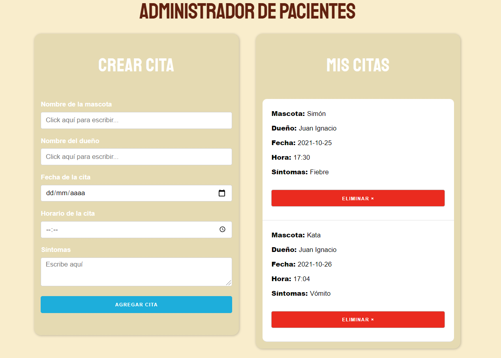

Aplicación simple de React para administrar pacientes en un veterinario. 

Se puede visitar este proyecto deployado en este [link](https://admin-pacientes.vercel.app/).

Este es un programa que realicé como ejercicio de estados, react-forms, react-hooks y localStorage. Gracias a la implementación de localStorage los datos ingresados (citas) quedan guardadas a nivel local y se puede seguir teniéndolos incluso si se sale de la página y se vuelve más tarde.

  

