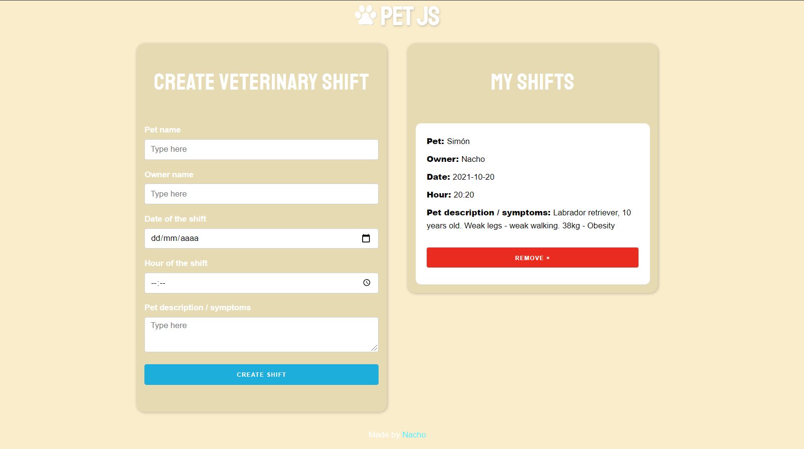

Aplicación simple de React para administrar pacientes en un veterinario. 

Se puede visitar este proyecto deployado en este [link](https://admin-pacientes.vercel.app/).

Gracias a la utilización de localStorage se pueden guardar los datos ingresados y seguirlos teniendo incluso si se sale de la página.

  

